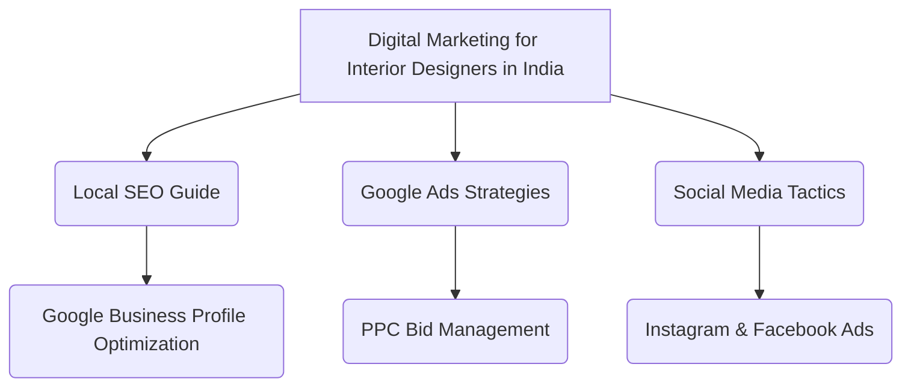

# Digital Marketing for Interior Designers in India — Get More Projects in 2026

**Digital Marketing for Interior Designers in India** is not just a buzzword; it's the lifeline for Interior Designers looking to thrive in the modern era. Welcome to your ultimate guide for dominating the market in 2026.

## The Wake-Up Call: Why Digital Marketing Matters for Interior Designers NOW

A newlywed couple in Gurgaon just bought their dream apartment and is scrolling Instagram for home decor inspiration. They want to see before/after reels and 3D visualizations. If your stunning portfolio isn't popping up on their feed, they'll hire the designer who caught their eye.

In India's hyper-competitive landscape, relying solely on traditional methods like trade shows, word-of-mouth, or physical networking is no longer enough. We at **Business Volunteers**, a founder-led digital marketing agency in Noida serving 89+ industries, have seen firsthand how companies transform their revenue by going digital. With over 2,700 clients across the country, we know exactly what it takes. Let's dive into the core strategies for Instagram portfolio, Pinterest traffic, before/after reels, 3D visualization marketing.

The Indian market is evolving at an unprecedented pace. With the advent of widespread 5G connectivity and affordable smartphones, even the most traditional sectors are seeing a massive shift towards digital procurement and vendor research. Buyers are no longer waiting for a sales representative to knock on their door; they are actively searching for solutions online. If your Interior Designers business is not prominently visible when they make these searches, you are losing out on significant revenue opportunities.

Moreover, the decision-making process has become increasingly complex, involving multiple stakeholders who conduct their own independent online research. This multi-threaded buyer journey necessitates a comprehensive digital presence that spans across search engines, social media platforms, industry-specific directories, and instant messaging apps like WhatsApp. A cohesive strategy that addresses each stage of the funnel—from initial awareness to final conversion—is critical for sustainable growth. 

At Business Volunteers, we emphasize a data-driven approach. By analyzing search trends, competitor activity, and user behavior, we craft campaigns that deliver measurable ROI. We understand that every Rupee spent on marketing must contribute to your bottom line. Therefore, our focus is not just on generating traffic, but on generating highly qualified leads that have a high probability of converting into paying customers. This requires a deep understanding of your unique value proposition and the specific pain points of your target audience.

## Chapter 1: Local SEO & Google Business Profile

For Interior Designers, Local SEO is your digital storefront. When someone searches for "Interior Designers near me" or "Interior Designers in Delhi", your Google Business Profile (GBP) is what shows up first.

**Why GBP is Critical:**
1. **Visibility:** It puts you directly on Google Maps, which is heavily used by Indian consumers and buyers alike to verify a company's physical existence and credibility.
2. **Trust:** Authentic reviews build instant credibility. In a market where trust is a major factor in business transactions, a 4.5+ star rating can be the deciding factor.
3. **Information:** Customers get your phone number, address, and hours immediately, removing friction from the contact process.

**Optimizing Your Local SEO Strategy for Interior Designers:**
To truly dominate local search in 2026, you must go beyond the basics. This involves consistent NAP (Name, Address, Phone Number) citations across all online directories, including platforms like JustDial, Sulekha, and specialized industry portals. Furthermore, regularly updating your GBP with new photos, posts about your recent projects or Instagram portfolio, Pinterest traffic, before/after reels, 3D visualization marketing, and responding promptly to both positive and negative reviews signals to Google that your business is active and relevant.

We also highly recommend implementing schema markup on your website. This specialized code helps search engines understand the context of your content, allowing them to display rich snippets in the search results. For Interior Designers, this could include displaying star ratings, pricing information, or specific service areas directly on the SERP, significantly improving your click-through rates.

## Chapter 2: Google Ads / PPC Strategy

When you want immediate results, Google Ads is the answer. For Interior Designers, the intent is already there. People aren't casually browsing for your services; they need them now.

### Table 1: Estimated Google Ads Metrics for Interior Designers
| Keyword Match | Est. CPC (₹) | Intent Level | Conversion Rate |
|---|---|---|---|
| Digital Marketing for Interior Designers in India | 45 - 80 | High | 8-12% |
| Best Interior Designers India | 55 - 95 | Medium | 5-9% |
| Interior Designers near me | 60 - 110 | Very High | 10-15% |
| Instagram portfolio services | 40 - 75 | High | 7-11% |

**Mastering Google Ads for High ROI:**
Running a successful Google Ads campaign in India requires meticulous keyword research and continuous optimization. We focus on long-tail keywords that demonstrate high commercial intent. For example, instead of bidding on broad terms that consume budget rapidly, we target specific phrases related to Instagram portfolio, Pinterest traffic, before/after reels, 3D visualization marketing. This ensures that your ads are only shown to users who are actively looking to make a purchase or sign a contract.

Furthermore, ad copy is crucial. Your ads must clearly communicate your Unique Selling Proposition (USP) and include a strong Call to Action (CTA). Utilizing ad extensions—such as sitelinks, callouts, and structured snippets—can significantly increase the real estate your ad occupies on the search results page, driving higher click-through rates. 

Equally important is the post-click experience. We design dedicated, highly relevant landing pages for each ad group. These landing pages are optimized for speed, mobile responsiveness, and conversion, ensuring that the traffic generated by your ads translates into actual leads and revenue.

## Chapter 3: Meta Ads (Facebook + Instagram)

While Google captures intent, Meta creates demand. For Interior Designers, Meta ads allow you to target specific demographics, interests, and behaviors.

**Leveraging Meta Ads for Targeted Reach:**
In 2026, the Meta ecosystem offers unparalleled targeting capabilities. By utilizing custom audiences and lookalike audiences, we can position your brand in front of decision-makers who are most likely to require your Interior Designers services. Whether it's showcasing your portfolio through high-quality Instagram Reels or generating leads via lead generation forms on Facebook, Meta provides versatile tools to achieve your marketing objectives.

A key component of our Meta Ads strategy is retargeting. We know that very few users convert on their first interaction with a brand. By installing the Meta Pixel on your website, we can track visitors and serve them targeted ads across Facebook and Instagram, reminding them of your offerings and encouraging them to complete the desired action.

Creative execution is also paramount. We develop compelling ad creatives that resonate with your target audience, highlighting Instagram portfolio, Pinterest traffic, before/after reels, 3D visualization marketing. This involves a mix of static images, engaging videos, and carousel ads that tell a cohesive brand story and drive engagement. Continuous A/B testing of ad copy, visuals, and targeting parameters ensures that your campaigns are always operating at peak efficiency.

## Chapter 4: WhatsApp Marketing (Scripts + Automation)

In India, WhatsApp is not just a messaging app; it's a business ecosystem. For Interior Designers, WhatsApp marketing can drastically reduce your sales cycle.

**Sample WhatsApp Script:**
"Hi [Name], this is [Your Name] from [Your Company]. We noticed your interest in our Interior Designers services. We're currently offering a free consultation this week. Would you be available for a 10-minute chat tomorrow at 11 AM to discuss Instagram portfolio?"

**The Power of WhatsApp Automation:**
Integrating the WhatsApp Business API with your CRM system is a game-changer. It allows for automated lead nurturing, instant responses to common queries, and personalized follow-ups at scale. When a prospect fills out a form on your website or interacts with your Meta ads, an automated WhatsApp message can be triggered instantly, engaging them while their interest is at its peak.

Furthermore, WhatsApp can be used to send updates, share brochures, and provide customer support, all within the platform that your clients use most frequently. This level of convenience and personalization fosters stronger relationships and significantly increases conversion rates. We help our clients design effective conversational flows that guide prospects seamlessly down the sales funnel, utilizing interactive buttons and rich media to enhance the user experience.

## Chapter 5: Social Media / Content Strategy

Content is how you prove your expertise. For Interior Designers, your content should focus on educating your audience, showcasing your past work, and highlighting your focus areas: Instagram portfolio, Pinterest traffic, before/after reels, 3D visualization marketing.

**Building a Robust Content Ecosystem:**
A successful content strategy goes beyond just posting updates. It involves creating a diverse mix of content formats—including blog posts, case studies, whitepapers, and videos—that address the specific pain points and informational needs of your target audience. By consistently publishing high-quality, relevant content, you establish your Interior Designers business as a thought leader and a trusted authority in the market.

On platforms like LinkedIn, we focus on sharing industry insights, company milestones, and employee spotlights to build a strong corporate brand. For visual platforms like Instagram or Pinterest, the focus shifts to showcasing the aesthetic or technical brilliance of your projects.

Content distribution is just as important as content creation. We utilize a multi-channel approach to ensure your content reaches the widest possible audience. This includes sharing content across your social media profiles, incorporating it into your email newsletters, and leveraging it in your paid advertising campaigns.

## Chapter 6: Online Reviews & Reputation Management

Your reputation precedes you. In the digital age, a single bad review can cost you a massive contract. For Interior Designers, managing your online reputation is non-negotiable.

**Proactive Reputation Management:**
We implement automated systems to encourage satisfied clients to leave positive reviews on platforms like Google, Trustpilot, and industry-specific forums. By proactively soliciting feedback, you can build a strong portfolio of social proof that reassures prospective clients of your reliability and expertise.

Equally important is how you handle negative reviews. We provide strategic guidance on how to respond to criticism professionally and constructively, turning potentially damaging situations into opportunities to demonstrate your commitment to customer satisfaction. A swift, empathetic, and solution-oriented response can often mitigate the impact of a negative review and even improve a customer's perception of your brand.

Monitoring brand mentions across the web is also a critical component of our reputation management strategy. By keeping a pulse on what people are saying about your Interior Designers business, we can identify potential issues early on and address them before they escalate into major crises.

## Chapter 7: KPI Dashboard & Measurement

You can't improve what you don't measure. At Business Volunteers, we provide our clients with real-time KPI dashboards. For Interior Designers, you need to track:

### Table 2: Key Performance Indicators (KPIs)
| Metric | Description | Target |
|---|---|---|
| Cost Per Lead (CPL) | The cost to acquire a new lead | < ₹500 |
| Conversion Rate | Percentage of leads that become clients | > 10% |
| Return on Ad Spend (ROAS) | Revenue generated per rupee spent on ads | 4x - 6x |
| Organic Traffic Growth | Month-over-month increase in SEO traffic | > 15% |
| Engagement Rate | Interaction levels on social media platforms | > 3% |

**Data-Driven Decision Making:**
Our custom KPI dashboards aggregate data from various sources—including Google Analytics, Google Ads, Meta Ads, and your CRM—providing a holistic view of your digital marketing performance. This level of transparency allows you to track the exact ROI of every campaign and make informed decisions about resource allocation.

We conduct regular performance reviews, analyzing the data to identify areas of strength and opportunities for improvement. This iterative approach ensures that your marketing strategy remains agile and responsive to changing market dynamics, continuously optimizing for maximum efficiency and effectiveness.

## Chapter 8: Website Optimization & CRO

Your website is your 24/7 salesperson. If it's slow, confusing, or not mobile-friendly, you're losing money. For Interior Designers, Conversion Rate Optimization (CRO) means turning visitors into paying clients.

**Enhancing User Experience (UX) and CRO:**
We conduct comprehensive audits of your website to identify usability issues and technical bottlenecks. This involves analyzing page load speeds, mobile responsiveness, and navigation structures to ensure a seamless and intuitive user experience. A fast, accessible website is not only critical for user satisfaction but also a significant ranking factor for search engines.

Our CRO strategies involve A/B testing various elements of your website—such as headlines, CTAs, forms, and layout—to determine what resonates best with your audience and drives the highest conversion rates. We employ tools like heatmaps and session recordings to gain deep insights into user behavior, allowing us to make data-backed design and structural improvements.

Furthermore, we ensure that your website's content is highly relevant, engaging, and clearly articulates your value proposition, specifically highlighting Instagram portfolio, Pinterest traffic, before/after reels, 3D visualization marketing. Persuasive copywriting, combined with strategic design elements, guides users effortlessly towards the desired conversion goal.

## Chapter 9: 30-Day Action Plan (Week-by-Week)

Ready to get started? Here is a 30-day action plan for Interior Designers:

### Table 3: 30-Day Implementation Guide
| Week | Focus Area | Key Actions |
|---|---|---|
| Week 1 | Foundation | Claim GBP, optimize website speed, install analytics |
| Week 2 | Content & SEO | Publish 2 blog posts, update meta tags, request 5 reviews |
| Week 3 | Paid Acquisition | Launch Google Ads campaign, set up Meta retargeting |
| Week 4 | Automation | Implement WhatsApp API, review KPIs, adjust bids |

**Execution and Beyond:**
This 30-day plan serves as a launchpad for your digital transformation. However, successful digital marketing is an ongoing process that requires continuous monitoring, testing, and refinement. As your partner, Business Volunteers will be with you every step of the way, ensuring that your campaigns remain aligned with your evolving business goals and deliver sustainable, long-term growth.

## Internal Linking & Cluster Map Diagram

## Frequently Asked Questions (FAQ)

**1. How much should Interior Designers spend on digital marketing?**
A typical budget ranges from ₹30,000 to ₹1,00,000 per month depending on the scale and aggression of the campaign, and your focus on Instagram portfolio, Pinterest traffic, before/after reels, 3D visualization marketing.

**2. Which platform is best for Interior Designers?**
It depends on your specific target audience. However, a strategic mix of Google Ads for capturing high-intent search traffic and WhatsApp for direct, personalized communication generally yields the best results.

**3. How long does it take to see results?**
Paid advertising platforms like Google Ads can generate qualified leads within 24 to 48 hours of campaign launch. Organic strategies like SEO and Content Marketing typically take 3 to 6 months to show significant traction.

**4. Can I manage this myself or with an in-house team?**
While possible, the complexities of managing multi-channel campaigns, optimizing ad spend, and staying updated with ever-changing algorithms require dedicated expertise. Partnering with a specialized agency often results in higher efficiency and a better ROI.

**5. How does Business Volunteers specifically help Interior Designers?**
We offer tailored, data-driven strategies that focus exclusively on your growth objectives. Our transparent approach, coupled with zero lock-in contracts and flexible post-pay options, ensures that we are fully aligned with your success.

**6. Is WhatsApp marketing legal and compliant in India?**
Yes, absolutely. Provided you use the official WhatsApp Business API, adhere to their commerce policies, and obtain explicit opt-in consent from your contacts, it is a fully compliant and highly effective marketing channel.

**7. How exactly do I track my return on investment (ROI)?**
We implement advanced tracking mechanisms and provide you with a customized, real-time KPI dashboard. This dashboard integrates data from your website, ad platforms, and CRM, giving you a clear, unambiguous view of your marketing performance and ROI.

## Conclusion

Digital marketing for Interior Designers is no longer optional—it is an absolute necessity for survival and growth. By implementing a comprehensive strategy that prioritizes Instagram portfolio, Pinterest traffic, before/after reels, 3D visualization marketing, you can effectively outpace your competition, capture market share, and secure a dominant position in 2026 and beyond.

**Ready to transform and grow your Interior Designers business?**
Contact **Business Volunteers** today! We are a founder-led agency in Noida, India, serving over 89+ industries with 2,700+ happy clients. We offer expert Local SEO, Google Ads, Meta Ads, WhatsApp Marketing, and comprehensive KPI reporting. 
**Call us at +91 90221 03227** or visit our website at **thegrowthpurpose.com**. 
*Post-pay available. No lock-in contracts.*

---
**Tags:** `Interior Designers`, `Digital Marketing India`, `SEO for Interior Designers`, `B2B Marketing`, `Lead Generation 2026`
