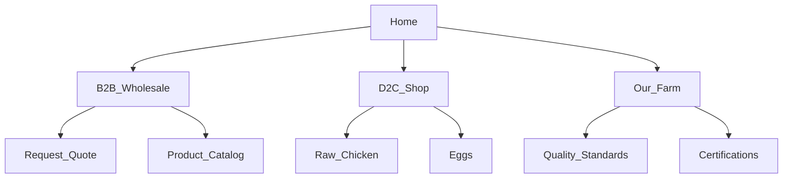

# Digital Marketing for Poultry Farms & Brands in India — 2026 Strategy

Digital Marketing for Poultry Farms in India might sound unconventional, but it is rapidly becoming the most effective way to cut out middlemen, secure consistent B2B orders, and build premium D2C (Direct-to-Consumer) brands. 

## The Reality of Running a Poultry Farm Today
A poultry farm owner in Haryana recently shared a common industry pain point: *"My farm supplies over 2,000 broilers weekly. We maintain excellent hygiene and quality. But my entire business relies on three local brokers. They dictate the prices, take a 15% margin, and if one of them drops me, my stock piles up. I want to supply directly to big restaurants and perhaps start my own local 'fresh chicken' delivery brand, but I don't know how."*

This reliance on brokers creates price vulnerability and squeezes margins. Digital Marketing for Poultry Farms empowers you to bypass the traditional supply chain. By building a digital presence, you can attract B2B buyers (hotels, restaurants, caterers - HoReCa) directly and establish a profitable D2C segment.

## Why Digital Marketing Matters for Poultry Businesses NOW

The Indian consumer is increasingly conscious about food safety, hygiene, and traceability. Concurrently, restaurants are looking for reliable, high-quality, and cost-effective direct suppliers.
A targeted digital strategy allows you to:
- **Acquire B2B Clients Directly:** Connect with restaurant owners and caterers searching for wholesale suppliers.
- **Build a Premium Brand:** Differentiate your products (e.g., antibiotic-free, free-range) to command higher margins.
- **Automate Order Management:** Streamline daily orders and logistics using WhatsApp.

Here is the comprehensive 9-chapter guide to digitalizing your poultry business in 2026.

---

## Chapter 1: B2B SEO & IndiaMart Optimization

For bulk B2B orders, your primary digital battlegrounds are Google Search and B2B directories like IndiaMart and TradeIndia. When a new hotel opens, the procurement manager searches online for suppliers.

**Optimization Strategies:**
1. **IndiaMart Mastery:** Ensure your profile has clear photos of your farm, processing unit, and product catalog. Reply to leads within 5 minutes.
2. **Local SEO (GBP):** Optimize your Google Business Profile for keywords like "wholesale chicken supplier [City]".
3. **Website SEO:** Create dedicated landing pages for specific buyers (e.g., "Poultry Supplier for Restaurants in Delhi NCR").

### High-Intent B2B Keyword Strategy

| Target Keyword | Monthly Search Volume (Est.) | User Intent | Difficulty |
| :--- | :--- | :--- | :--- |
| Wholesale chicken supplier near me | 3,500 | B2B Procurement | Medium |
| Fresh broiler supplier [City] | 1,800 | HoReCa sourcing | Low-Medium |
| Antibiotic free chicken brand | 2,200 | Premium B2B / D2C | High |
| Poultry farm in [State] | 4,000 | General sourcing / Directory | Medium |

---

## Chapter 2: Google Ads for Direct Procurement

Google Ads is highly effective for capturing procurement managers actively searching for suppliers. Because B2B orders have a high lifetime value, you can afford a higher cost-per-click.

**B2B Google Ads Strategy:**
- **Search Campaigns:** Target precise queries like "bulk poultry supplier Noida" or "restaurant chicken supplier."
- **Negative Keywords:** Exclude terms like "recipe," "how to cook," or "retail shop" to avoid wasting clicks on general consumers.
- **Lead Generation Forms:** Drive traffic to a landing page with a simple form: "Request a Wholesale Quote."

### Estimated Monthly Budget & CPC Guide

| Campaign Type | Avg CPC (₹) | Suggested Monthly Budget (₹) | Target Audience |
| :--- | :--- | :--- | :--- |
| B2B Search (Wholesale) | 30 - 60 | 25,000 | Restaurant Owners, Caterers |
| Brand Protection | 10 - 20 | 5,000 | Direct Searches |
| D2C Local Delivery (If applicable) | 20 - 40 | 15,000 | Local Consumers |

---

## Chapter 3: Meta Ads (Facebook + Instagram) & LinkedIn

Social media is crucial for two things: building a trusted brand image (D2C) and networking with business owners (B2B).

**Platform Strategies:**
- **LinkedIn (B2B):** Connect with chefs, restaurant owners, and procurement heads. Share posts about your farm's biosecurity measures, quality checks, and production capacity.
- **Instagram (D2C & Brand Building):** Show the "Farm-to-Table" journey. High-quality visuals of clean facilities and fresh products build massive trust among consumers looking for hygienic meat.
- **Facebook Lead Ads:** Run localized campaigns targeting restaurant owners with offers like "Get your first 50kg wholesale order at a 10% discount."

### Audience Targeting Strategy

| Platform | Target Audience | Objective | Content/Format |
| :--- | :--- | :--- | :--- |
| LinkedIn | Procurement Managers, F&B Directors | B2B Contracts | Industry Reports, Farm Hygiene Posts |
| Facebook | Local Restaurant / Dhaba Owners | B2B Leads | Lead Gen Ads with Volume Discounts |
| Instagram | Health-conscious locals, Gym goers | D2C Sales / Brand | Reels showing freshness, Protein focus |

---

## Chapter 4: WhatsApp Marketing & Automation

In the wholesale business, WhatsApp is your ERP (Enterprise Resource Planning) system. It’s where daily orders, price updates, and logistics are managed.

### 4 Essential WhatsApp Scripts for Poultry Suppliers

**1. The Daily Rate Broadcast (B2B):**
> "Good Morning 🐔! Today's wholesale rates (Minimum order 50kg):
> Broiler (Live): ₹[Price]/kg
> Dressed Whole: ₹[Price]/kg
> Boneless Breast: ₹[Price]/kg
> Reply with your order quantity by 2 PM for tomorrow morning delivery!"

**2. The New Restaurant Outreach:**
> "Hi [Name], we noticed your new restaurant opening in [Area]—congratulations! 🎉 We are a local poultry farm supplying fresh, antibiotic-free chicken to 20+ top restaurants. Would you like a sample and our wholesale price list?"

**3. The D2C Order Confirmation:**
> "Hello [Name], your order for 2kg Premium Boneless Chicken is confirmed! 🥩 It will be delivered fresh, perfectly chilled, by 11 AM tomorrow. Track your delivery here: [Link]."

**4. Quality Assurance Follow-up:**
> "Hi [Name], checking in on your recent bulk order. Was the grading and freshness up to your chef's standards? We value your feedback to maintain our quality. 💯"

---

## Chapter 5: Social Media / Content Strategy

Transparency is your biggest marketing asset. Consumers and B2B buyers alike want to know where their food comes from.

**Content Pillars:**
1. **The Farm Tour:** Videos showing clean coops, automated feeding systems, and biosecurity protocols.
2. **Quality Certifications:** Highlight FSSAI, ISO, or Halal certifications prominently.
3. **The Supply Chain:** Show the hygienic packing and cold-chain logistics from farm to delivery truck.
4. **Nutritional Education:** Content focused on protein quality, antibiotic-free rearing, and farm-to-table freshness.

---

## Chapter 6: Online Reviews & Reputation Management

For food products, trust and hygiene are paramount. A reputation for delivering stale or under-weight products will spread quickly in local B2B circles.

- **Collect Video Testimonials:** Get short clips from local chefs praising your consistent quality and timely delivery.
- **Google Reviews:** Actively seek reviews for your distribution centers or D2C brand from happy customers.
- **Crisis Management:** If a delivery is delayed or an order is wrong, handle it immediately and transparently.

---

## Chapter 7: KPI Dashboard & Measurement

Track these metrics to ensure your digital transition is profitable.

| Metric | What it Tells You | Target Benchmark |
| :--- | :--- | :--- |
| Cost Per B2B Lead | Marketing cost to get a wholesale inquiry | ₹150 - ₹500 |
| B2B Conversion Rate | Leads turned into recurring clients | 10% - 20% |
| Customer Lifetime Value (LTV) | Value of a restaurant contract over time | ₹2,00,000+ |
| D2C Repeat Purchase Rate | Brand loyalty among retail consumers | 40% - 60% |

---

## Chapter 8: Website Optimization & CRO

Your website must cater to two distinct audiences: bulk buyers and retail consumers.

**Optimization Strategies:**
- **B2B Portal:** A hidden or dedicated section where approved restaurant partners can log in and place bulk orders easily.
- **Clear Value Proposition:** "Farm Fresh. Antibiotic-Free. Delivered Daily."
- **Certifications Bar:** Prominently display all health and safety badges on the homepage.
- **D2C E-commerce:** If selling retail, ensure a seamless checkout process with localized delivery pin code checkers.

### Site Architecture Map

---

## Chapter 9: 30-Day Action Plan

**Week 1: Digital Foundation**
- Optimize Google Business Profile and IndiaMart listings.
- Build a robust B2B landing page highlighting farm capacity and hygiene.
- Set up WhatsApp Business API.

**Week 2: Content & Asset Creation**
- Shoot professional photos/videos of the farm, processing unit, and delivery vehicles.
- Create digital brochures and wholesale price lists.
- Optimize LinkedIn profiles of the founders/sales heads.

**Week 3: Campaign Launch**
- Launch Google Search campaigns targeting wholesale procurement keywords.
- Start Facebook Lead Ads targeting local restaurant owners.
- Begin daily WhatsApp price broadcasts to your existing network.

**Week 4: Outreach & Optimization**
- Initiate outbound LinkedIn messaging to F&B managers.
- Review lead quality from Google Ads and adjust negative keywords.
- Implement a feedback loop for all new deliveries.

---

## FAQ Section

**1. How can digital marketing help a traditional poultry farm?**
It helps you bypass brokers by connecting you directly with wholesale buyers (restaurants, caterers) and allows you to build a premium, higher-margin retail brand.

**2. Are B2B directories like IndiaMart useful?**
Yes, highly useful. Many procurement managers still use them to source local suppliers. However, your profile must stand out with high-quality images and rapid response times.

**3. How do we target restaurants on Facebook?**
You can use Meta's detailed targeting to reach people interested in "Restaurant Management," "Catering," or people who are administrators of Facebook Business Pages in the food sector.

**4. Is a website necessary if we only want B2B clients?**
Yes. A professional website acts as your digital brochure. When you pitch a large hotel, their procurement team will research you online. A good website builds instant credibility.

**5. How do we handle daily price fluctuations in marketing?**
Use WhatsApp Broadcasts to your opted-in B2B list to announce daily rates. Keep website prices as "Estimates" or require a "Request Quote" for bulk orders.

**6. Can we build a D2C brand alongside our wholesale business?**
Absolutely. Many successful farms supply bulk generic chicken to restaurants while packaging premium, branded cuts (e.g., antibiotic-free) for direct retail consumers at higher margins.

**7. What is the biggest selling point we should promote?**
Hygiene, traceability, and consistency. Buyers want to know the meat is safe, processed cleanly, and that you can deliver reliable quantities every single day.

---

## Conclusion

The poultry industry is ripe for digital disruption. Farm owners who continue to rely solely on traditional broker networks will see their margins squeezed. By leveraging Local SEO, targeted Google Ads, and efficient WhatsApp communication, you can build direct, profitable relationships with restaurants and consumers, taking full control of your business in 2026.

**Ready to modernize your poultry business?**
At Business Volunteers, a founder-led digital marketing agency in Noida, we help agribusinesses and B2B suppliers build robust digital sales channels. We can help you dominate local search, manage B2B lead generation, and automate your WhatsApp orders.

📞 **Call us today:** +91 90221 03227
🌐 **Visit:** [thegrowthpurpose.com](https://thegrowthpurpose.com)

---
*Tags: #PoultryFarmingIndia #AgriBusinessMarketing #B2BMarketing #D2CBrands #BusinessVolunteers #FoodSupplySEO*
