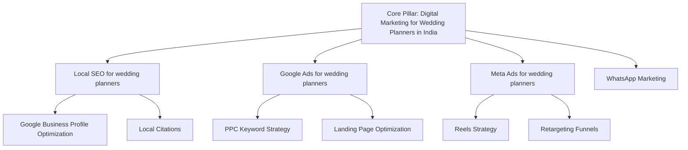

# Digital Marketing for Wedding Planners in India — Book More Weddings in 2026

**Digital Marketing for Wedding Planners in India** is no longer just a luxury; it is the fundamental backbone of surviving and thriving in India's highly competitive market. Whether you are operating out of bustling streets in Delhi, managing operations in Mumbai, or targeting local clients in Noida and Bangalore, Digital Marketing for Wedding Planners in India is what will set you apart from your competitors in 2026 and beyond. 

In this comprehensive masterclass, we will cover every single aspect of **Digital Marketing for Wedding Planners in India**. We will dive deep into local SEO, Google Ads, Meta Ads, WhatsApp marketing, and much more. 

---

## The Wake-Up Call: A Real Story from the Wedding Planners Industry

Imagine Ramesh, a hardworking business owner who started his wedding planning business in a premium locality in Pune. Ramesh had the best quality offerings. He invested heavily in the physical infrastructure, hired the best staff, and waited for the magic to happen. The first few months were decent, relying purely on word-of-mouth. But soon, the footfall stagnated. Revenues plateaued. Meanwhile, a competitor just 2 kilometers away, with arguably inferior quality, was seeing lines out the door and their phone wouldn't stop ringing. 

What was the difference? The competitor had a robust strategy for **Digital Marketing for Wedding Planners in India**. They were visible on Google when customers searched for "wedding planners near me". They were running targeted Instagram ads showcasing their USP. They were using WhatsApp to re-engage past customers with irresistible offers. 

Ramesh realized that in today's India, being good offline is not enough. You must exist online, and you must dominate online. This story is not just Ramesh's; it is the story of thousands of wedding planners across India. 

## Why Digital Marketing for Wedding Planners in India Matters NOW

India's digital landscape has exploded. With over 800 million internet users, dirt-cheap Jio data, and the ubiquitous nature of UPI, the Indian consumer journey has fundamentally shifted online. When an Indian consumer wants something, they Google it. When they are bored, they scroll through Instagram. When they want to communicate, they use WhatsApp. 

If your wedding planning business is not present at these touchpoints, you are practically invisible. 

### Key Statistics for Wedding Planners in India (2026)
- **78%** of Indian consumers search online before visiting a physical location or booking a service.
- **WhatsApp** has an open rate of 98% in India, making it the most powerful CRM tool for wedding planners.
- **Meta Ads (Facebook & Instagram)** allow you to target users based on hyper-local radii, interests, and past purchasing behavior, giving you unprecedented ROI.

---

## Chapter 1: Local SEO & Google Business Profile (GBP)

For wedding planners, Local SEO is the absolute holy grail. When someone searches for "best wedding planning near me" or "top wedding planners in [City]", you need to be in the Google Local Pack (the top 3 map results). 

### How to Optimize Your Google Business Profile
1. **Claim and Verify**: Ensure your listing is claimed and verified.
2. **Accurate NAP**: Name, Address, Phone Number must be 100% consistent across the internet.
3. **Keyword-Rich Description**: Include terms like "wedding planning", your city, and your core services.
4. **High-Quality Photos**: Upload new photos weekly. Show the facade, the interiors, the team, and happy customers. Indian consumers trust businesses with authentic photos.
5. **Google Posts**: Treat GBP like a social media platform. Post weekly offers, updates, and news.

### Local SEO Strategy Table

| Task | Frequency | Impact Level | Tool/Platform |
|---|---|---|---|
| Update GBP Photos | Weekly | High | Google Business Profile |
| Reply to Reviews | Daily | High | GBP / Reputation Manager |
| Publish Google Posts | Bi-weekly | Medium | Google Business Profile |
| Local Citations (Justdial, Sulekha) | Monthly | Medium | Various Directories |
| Optimize Website Geo-tags | Once/Quarter | High | Website CMS |

Building local citations on Indian platforms like Justdial, Sulekha, and IndiaMart (for B2B) also sends strong local signals to Google.

---

## Chapter 2: Google Ads / PPC Strategy

When someone is actively searching for wedding planners, they have high intent. Google Search Ads put you right at the top of the results page.

### The Power of Search Intent
Unlike social media where you interrupt someone's scrolling, Google Ads answer a direct query. For wedding planners, capturing high-intent searches is the fastest way to generate leads or footfall.

### Recommended Campaign Structure for Wedding Planners
- **Brand Campaign**: Bidding on your own brand name so competitors don't steal your traffic. CPCs here are usually very cheap (₹2 - ₹5).
- **Core Service/Product Campaign**: Bidding on terms like "best wedding planning in Delhi" or "affordable wedding planning near me". 
- **Competitor Campaign**: Bidding on your competitors' names.

### CPC Estimates for Wedding Planners in Tier 1 & Tier 2 Cities

| Keyword Category | Avg. CPC Tier 1 (₹) | Avg. CPC Tier 2 (₹) | Intent |
|---|---|---|---|
| Brand Keywords | 2 - 10 | 1 - 5 | Extremely High |
| Broad "wedding planning near me" | 30 - 80 | 15 - 40 | High |
| Specific Service/Product | 40 - 100 | 20 - 50 | High |
| Competitor Names | 50 - 120 | 25 - 60 | Medium |

*Note: Actual CPCs may vary based on exact location and competition density.*

---

## Chapter 3: Meta Ads (Facebook + Instagram)

While Google captures existing demand, Meta Ads *create* demand. For wedding planners, Instagram and Facebook are where you build your brand identity and showcase your offerings visually.

### The Indian Meta Ecosystem
Indians spend an average of 2.5 hours on social media daily. Reels are the most consumed content format.

### Strategies for Wedding Planners
1. **Hyper-Local Targeting**: If you have a physical location, drop a pin and target a 3km-5km radius. 
2. **Lookalike Audiences**: Upload your existing customer database and let Meta find similar people.
3. **Retargeting**: Show ads to people who visited your website but didn't convert, or engaged with your Instagram profile.

### Ad Budget Allocation Guide

| Funnel Stage | Content Type | Budget Allocation | Goal |
|---|---|---|---|
| Top of Funnel (Cold) | Educational Reels, High-quality photos, Broad pain points | 50% | Brand Awareness, Reach |
| Middle of Funnel (Warm) | Customer Testimonials, In-depth service videos, Comparisons | 30% | Consideration, Lead Gen |
| Bottom of Funnel (Hot) | Hard Offers, Discounts, Urgent CTAs (Book Now) | 20% | Direct Conversion |

---

## Chapter 4: WhatsApp Marketing (Scripts + Automation)

In India, WhatsApp is not just a messaging app; it is the internet for many. WhatsApp Business API allows wedding planners to automate customer journeys, send bulk promotional messages without getting banned, and provide instant customer support.

### Why WhatsApp Marketing is a Game-Changer
- **98% Open Rate**: Nothing else comes close. Not emails, not SMS.
- **Rich Media**: You can send PDFs, images, videos, and interactive buttons.
- **Conversational Commerce**: Customers can browse your catalog and place orders directly on WhatsApp.

### Automated WhatsApp Flows for Wedding Planners

1. **Welcome Flow**: When someone messages your business number for the first time.
   > "Namaste! 🙏 Welcome to [Your Brand]. How can we help you today? 
 1. Book an Appointment/Order 
 2. View Menu/Catalog 
 3. Speak to a Human"
2. **Abandoned Cart/Drop-off**: When someone inquires but doesn't complete the action.
   > "Hi [Name], we noticed you were interested in our wedding planning services. Use code FESTIVE10 for a 10% discount if you book today! ⏳"
3. **Post-Purchase Review Request**:
   > "Hi [Name], thank you for choosing us! We hope you loved your experience. Could you take 10 seconds to rate us on Google? [Link] ⭐⭐⭐⭐⭐"

---

## Chapter 5: Social Media / Content Strategy

For wedding planners, content is how you build trust before a transaction even happens.

### The 3E Framework: Educate, Entertain, Engage

1. **Educate**: Answer common questions. Show the behind-the-scenes of your wedding planning business. Explain why your quality is superior.
2. **Entertain**: Use trending audio on Instagram Reels. Hop on relevant trends that fit your brand voice.
3. **Engage**: Host Q&As, run polls on Stories, ask for user-generated content (UGC).

### Content Calendar Example (Week 1)

- **Monday**: Motivational/Aspirational post related to wedding planning.
- **Tuesday**: Educational Carousel (e.g., "5 Things to look for in a good wedding planning").
- **Wednesday**: Behind-the-scenes Reel (showing your team hard at work).
- **Thursday**: Customer Testimonial (Video or Quote).
- **Friday**: Promotional Post (Weekend offer or special package).
- **Saturday**: Interactive Story Polls.
- **Sunday**: Community spotlight or user-generated content.

---

## Chapter 6: Online Reviews & Reputation Management

In India, trust is everything. For wedding planners, reviews can make or break the business. 90% of Indian consumers read reviews before making a purchase decision or visiting a store.

### How to Get More Reviews
1. **Just Ask**: Train your staff to ask for reviews at the point of sale when the customer is happiest.
2. **QR Codes**: Place QR codes at your billing counter or on your packaging linking directly to your Google Review page.
3. **Incentivize**: (Carefully) offer a small discount on the next purchase for leaving an honest review.
4. **WhatsApp Automation**: As discussed in Chapter 4, automate the review request.

### Handling Negative Reviews
Never ignore a negative review, and never argue. Respond professionally:
> "Dear [Name], we are extremely sorry to hear about your experience. This is not the standard we strive for. Please DM us your contact number or call us at [Number] so we can make this right."
This shows future readers that you care about customer satisfaction.

---

## Chapter 7: KPI Dashboard & Measurement

You cannot improve what you do not measure. For wedding planners, tracking the right Key Performance Indicators (KPIs) ensures your marketing budget isn't being wasted.

### Essential KPIs for Wedding Planners

| KPI | Description | Ideal Benchmark |
|---|---|---|
| Customer Acquisition Cost (CAC) | Total marketing spend / Number of new customers | Varies by ticket size |
| Return on Ad Spend (ROAS) | Revenue generated / Ad spend | > 3x - 5x |
| Conversion Rate | Percentage of website/profile visitors who buy/book | 2% - 5% |
| Click-Through Rate (CTR) | Percentage of ad viewers who click | 1.5% - 3% |
| Cost Per Lead (CPL) | Cost to acquire one inquiry/lead | ₹50 - ₹300 |

At **Business Volunteers**, we provide all our clients with a transparent, real-time KPI dashboard so you know exactly where every Rupee is going.

---

## Chapter 8: Website Optimization & CRO

Your website is your digital storefront. If your website is slow, confusing, or not mobile-friendly, all the traffic you generate from Google and Meta ads will be wasted.

### Conversion Rate Optimization (CRO) for Wedding Planners
1. **Mobile-First Design**: 90% of your traffic in India will come from mobile devices. Your site must load in under 3 seconds on a 4G connection.
2. **Clear Call-to-Action (CTA)**: Use prominent buttons like "Book Now," "Get a Quote," or "WhatsApp Us." Sticky WhatsApp buttons at the bottom right are incredibly effective in India.
3. **Trust Signals**: Display Google reviews, secure payment badges (Razorpay, Paytm), and client logos prominently.
4. **Frictionless Forms**: Keep inquiry forms short. Name, Number, and Service required. The longer the form, the higher the drop-off.

---

## Chapter 9: 30-Day Action Plan (Week-by-Week)

Ready to implement **Digital Marketing for Wedding Planners in India**? Here is your blueprint.

### Week 1: Foundation
- Claim, verify, and optimize your Google Business Profile.
- Audit your website for mobile speed and clear CTAs.
- Set up Google Analytics and Meta Pixel.

### Week 2: Content & Social
- Create 10 pieces of high-quality content (videos and images).
- Set up your Meta Business Suite.
- Start scheduling 3-4 posts per week across Instagram and Facebook.

### Week 3: Paid Ads Launch
- Launch your Google Search Brand Campaign.
- Launch a Local Awareness Meta Ad targeting a 5km radius around your business.
- Allocate a small test budget (e.g., ₹500/day).

### Week 4: Automation & Review Gen
- Integrate a WhatsApp Business API provider.
- Set up the Welcome and Abandoned Cart automated flows.
- Print QR codes for Google Reviews and place them strategically.

---

## Internal Linking & Content Cluster Map

---

### Deep Dive: Advanced Strategies for Digital Marketing for Wedding Planners in India

To truly succeed in the wedding planning sector, we must go beyond the basics. Let's look at advanced tactics that industry leaders use in 2026.

#### Advanced Google Ads Tactics
When running search campaigns for wedding planners, negative keywords are as important as your actual keywords. If you sell premium services, you must negate terms like "cheap", "free", "discount", and "low cost" to ensure you don't waste budget on unqualified leads. Furthermore, utilizing Google's Performance Max (PMax) campaigns can help you reach customers across Search, YouTube, Display, Discover, Gmail, and Maps from a single campaign. PMax uses machine learning to find conversions, which is highly beneficial for wedding planners with well-defined conversion goals.

#### Video Marketing Dominance
YouTube is the second largest search engine in the world, and in India, it is heavily used for local searches and reviews. Creating a YouTube channel for your wedding planning business can establish massive authority. Content ideas include:
- Walkthroughs of your physical location.
- Detailed explanations of your wedding planning processes.
- Customer success stories and video testimonials.
- Meet the team videos to build human connection.

#### Influencer Marketing in the wedding planning Space
Micro-influencers (10k to 50k followers) in your specific city offer incredible ROI. Unlike mega-influencers who charge exorbitant fees, local micro-influencers often work on barter (free product/service in exchange for a Reel) or charge minimal fees (₹2,000 - ₹5,000). Their audience is highly engaged and geographically relevant. 
When selecting an influencer for your wedding planning business, look at their engagement rate (likes and comments relative to followers), not just their follower count. Make sure their aesthetic aligns with your brand.

#### Data-Driven Decision Making
In 2026, data is the new oil. Integrating your CRM with your marketing channels is essential. If a lead comes from a Meta Ad, goes into your CRM, and eventually converts, that conversion data MUST be sent back to Meta via the Conversions API (CAPI). This trains Meta's algorithm to find more people exactly like your best customers. 
Similarly, offline conversions can be uploaded to Google Ads. For wedding planners, where the final transaction often happens offline, bridging the online-to-offline data gap is the key to scaling ad spend profitably.

#### Retention and Loyalty Programs
Acquiring a new customer for your wedding planning business costs 5 times more than retaining an existing one. Digital marketing is not just about acquisition; it's about retention. 
- **Email Marketing**: While less popular than WhatsApp in India, email is still vital for B2B or premium wedding planning services. Sending a monthly newsletter with updates, tips, and exclusive offers keeps your brand top-of-mind.
- **Loyalty Points System**: Implement a digital loyalty program where customers earn points tied to their phone number. They can check their balance via a simple WhatsApp message and redeem points on their next visit.

#### Local Partnerships and Co-Marketing
Identify non-competing businesses in your locality that share your target demographic. For example, if you run a premium wedding planning business, partner with a local high-end fitness center. You can run joint social media giveaways or offer exclusive discounts to each other's customer base. This cross-pollination of audiences is a highly effective, low-cost digital marketing strategy.

#### Voice Search Optimization
With the proliferation of Alexa, Google Home, and Siri, more Indians are using voice search. Voice queries are longer and more conversational than typed queries. Instead of typing "best wedding planning Delhi", a user might ask, "Hey Google, where is the best wedding planning business near me that is open right now?" 
To optimize for voice search:
- Ensure your Google Business Profile hours are strictly accurate.
- Create an FAQ page on your website that answers conversational questions.
- Use long-tail keywords in your content strategy.

#### The Role of AI in wedding planning Marketing
Artificial Intelligence is revolutionizing how wedding planners operate. In 2026, AI can be used for:
- **Chatbots**: 24/7 customer support on your website answering basic queries about pricing and timings.
- **Content Creation**: Using tools to brainstorm blog topics, write social media captions, and generate ad copy.
- **Predictive Analytics**: Forecasting busy periods so you can scale up your ad spend proactively.

#### Understanding the Indian Consumer Psychology
The Indian consumer is uniquely value-conscious. They want the best quality but are always looking for a 'deal'. Your digital marketing messaging for wedding planners must balance premium positioning with perceived value. 
Use psychological triggers like:
- **Scarcity**: "Only 3 slots left for this weekend!"
- **Social Proof**: "Join 5,000+ happy customers in [City]."
- **Authority**: "Awarded Best wedding planning by [Local Authority]."

#### Omnichannel Marketing 
The modern customer journey is not linear. A user might discover your wedding planning business via an Instagram Reel, search for your reviews on Google a week later, visit your website, leave, get retargeted by a Meta ad, and finally book via WhatsApp. 
Your branding, messaging, and offers must be consistent across all these channels. If you have a festive offer running, it needs to be updated on your website banner, Google Business Profile post, Instagram bio, and sent as a WhatsApp broadcast.

### Comprehensive Financial Modeling for Digital Marketing in wedding planning

Let's break down a hypothetical budget for a medium-sized wedding planning business in a Tier 1 Indian city (e.g., Delhi, Mumbai, Bangalore) looking to aggressively expand their digital footprint.

**Monthly Budget Allocation (Example: ₹1,00,000)**

| Marketing Channel | Budget Allocation | Expected Deliverables/Spend |
|---|---|---|
| Google Search Ads | ₹35,000 | Targeted search intent capturing, prioritizing high-converting keywords. |
| Meta Ads (FB/IG) | ₹30,000 | Brand awareness, lead generation via lead forms, retargeting website visitors. |
| Local SEO & GBP | ₹15,000 | Regular content updates, review generation, local citation building. |
| WhatsApp & CRM | ₹10,000 | WhatsApp API costs, automated flows, bulk promotional messaging. |
| Content Creation | ₹10,000 | Graphic design for ads, basic video editing for Reels. |

**Expected ROI Projection (Conservative Estimate)**
- Google Ads: Assuming a ₹70 CPC, ₹35,000 buys 500 clicks. At a 10% conversion rate (inquiries), that's 50 high-quality leads.
- Meta Ads: Assuming a ₹150 CPL (Cost Per Lead), ₹30,000 buys 200 leads.
- Local SEO: Organic traffic generates approximately 30-50 direct calls/walk-ins per month.
- **Total Leads/Inquiries**: ~300 per month.
- **Final Conversion**: If your sales team/process converts 20% of these inquiries into paying customers, that is 60 new customers per month.
- If the average Lifetime Value (LTV) or Average Order Value (AOV) of a customer in the wedding planning industry is ₹5,000, the total revenue generated is ₹3,00,000.
- **ROAS**: 3x return on marketing spend. 

This financial model demonstrates why **Digital Marketing for Wedding Planners in India** is an investment, not an expense. By systematically optimizing each step of the funnel, wedding planners can predictably scale their revenue.

#### Scaling Operations
As your digital marketing efforts start bringing in more business, your physical operations must keep up. A common pitfall for wedding planners is launching a highly successful marketing campaign but failing to deliver on customer service due to volume. 
- Ensure your staff is trained to handle digital leads promptly. A lead called within 5 minutes of inquiring is 10x more likely to convert than one called after 24 hours.
- Automate appointment scheduling using tools like Calendly or native website bookers to reduce administrative load.

### Building a Long-Term Brand Legacy
Digital marketing provides the tools, but your core offering builds the legacy. In the wedding planning space, authenticity wins. Do not use stock photos of foreign models if you are a local Indian business. Show real Indian faces, real Indian contexts, and genuine stories. 
Connect with your local community by sponsoring local events, participating in community drives, and documenting these efforts on your social media channels. 

The businesses that view digital marketing merely as a transactional tool will see short-term spikes. The businesses that view digital marketing as an extension of their brand's voice and customer service will build multi-generational legacies in the Indian market.

---

### Extensive Breakdown of Meta Ads Strategy for Wedding Planners

In India, the consumption of Meta products (Facebook, Instagram, WhatsApp) is unparalleled. Let's explore a granular, step-by-step methodology for setting up Meta Ads for a wedding planning business.

#### 1. The Architecture of the Meta Pixel
Before spending a single Rupee, the Meta Pixel must be flawlessly integrated into your website. For wedding planners, standard events like 'PageView' are insufficient. You need to track 'Lead', 'InitiateCheckout', 'Purchase', or custom conversions like 'WhatsApp Button Click'.
- **Why it matters**: The Pixel is the brain of your Meta Ads. It learns who is interacting with your brand and seeks out similar individuals across the platform's vast network.

#### 2. Advanced Audience Segmentation
- **Custom Audiences**: Upload your past customer list (phone numbers/emails). Meta will match these and allow you to serve ads directly to them—perfect for upselling or festive offers.
- **Lookalike Audiences (LAL)**: Once you have a Custom Audience of at least 500 people, you can create a 1%, 2%, or 5% Lookalike Audience. This means Meta will find the top 1% of users in India (or your specific city) who most closely resemble your best customers. For wedding planners, a 1% LAL of 'Past Purchasers' is often the most profitable cold audience.
- **Detailed Targeting**: Target users interested in competitors, broader wedding planning magazines, or complementary industries. For instance, if you are a premium wedding planning brand, targeting users interested in luxury cars or high-end travel can yield qualitative leads.

#### 3. Creative Best Practices for 2026
In 2026, user-generated content (UGC) and lo-fi videos significantly outperform highly polished, studio-quality ads. 
- **The 3-Second Hook**: Your video must grab attention immediately. Use text overlays and fast-paced editing.
- **Native Formatting**: Ensure all ads are designed in 9:16 vertical format for Reels and Stories. 
- **Localized Copy**: Using Hinglish or local regional languages (Marathi in Pune, Tamil in Chennai) drastically increases ad relevance and decreases cost-per-click.

#### 4. The Campaign Objectives
- **Lead Generation**: Use native Meta Lead Forms for quick inquiries. The user doesn't even have to leave the app.
- **Traffic / Conversions**: Send users to a highly optimized landing page on your website. 
- **Engagement (WhatsApp)**: Run ads that click directly to your WhatsApp Business number. This is extraordinarily effective for wedding planners in India, as consumers prefer chatting over calling or filling out forms.

---

### Deep Dive into Google Ads: Search vs. Display vs. PMax for Wedding Planners

Google Ads is an ecosystem. Understanding which network to use when is critical for wedding planning businesses.

#### The Search Network
As discussed, this is for capturing existing demand. The key to profitability here is **Quality Score**. Google assigns a Quality Score (1-10) based on expected click-through rate, ad relevance, and landing page experience. A high Quality Score means you pay less per click than your competitors.
- **Pro Tip for wedding planners**: Ensure the keyword the user searched for is in the Ad Headline and prominently displayed on the landing page.

#### The Display Network
Display ads are the banner ads you see across the internet on blogs, news sites, and apps. For direct conversions in the wedding planning sector, Display is generally poor. However, for **Retargeting**, it is phenomenal. 
- **Strategy**: Show banner ads to users who visited your site but didn't convert, offering a time-sensitive discount. The visual reminder as they browse other sites keeps your brand top-of-mind.

#### Performance Max (PMax)
PMax represents the future of Google Ads. It is goal-based and automated. You provide Google with assets (headlines, descriptions, images, videos), and Google's AI mixes and matches them across all channels to drive the specified conversion goal.
- **Consideration for wedding planners**: PMax requires data to work well. Do not use PMax until your account has historical conversion data (at least 30 conversions per month). 

---

### The Ultimate WhatsApp Marketing Playbook for Wedding Planners

Let's expand on the WhatsApp API capabilities, which are indispensable in 2026.

#### Interactive Messages
Instead of sending plain text, you can send messages with interactive buttons (e.g., "Yes, I'm interested", "Call Me", "View Website"). This reduces friction and increases response rates by up to 60%.

#### Catalog Integration
You can upload your entire product/service catalog to WhatsApp. Users can browse categories, add items to a cart, and send the cart to you—all without leaving the chat interface. For wedding planners, this simplifies the buying process tremendously.

#### Transactional Updates
Keep your customers informed automatically.
- "Your booking is confirmed for tomorrow at 10 AM."
- "Your order has been dispatched."
- "Thank you for visiting! Here is your invoice."
These automated touchpoints build immense trust and professional credibility.

#### Drip Campaigns
You can set up a sequence of messages. For example, if a user inquires but doesn't buy:
- Day 1: "Hi, still thinking about our wedding planning services? Let us know if you have questions!"
- Day 3: "Here are some reviews from happy customers..."
- Day 7: "Final call! Get 15% off if you book today."

---

### Advanced Local SEO Tactics

Dominating the local map pack requires more than just claiming your profile. 

#### Managing Questions & Answers
Anyone can ask a question on your Google Business Profile, and anyone can answer it. Do not let random users answer on your behalf. Actively seed your own Q&A section with common questions about your wedding planning business and provide detailed, keyword-rich answers.

#### Spam Fighting
Many competitors will try to game the system by stuffing keywords into their business name (e.g., "Best wedding planning in Delhi Ramesh Enterprises"). This is against Google's guidelines. You can report these listings via the "Suggest an Edit" feature. Cleaning up competitor spam can instantly boost your legitimate listing's ranking.

#### Hyper-Local Content Silos on Your Website
If you serve multiple areas in a city, create dedicated location pages. 
- `yourwebsite.com/wedding-planners-in-andheri`
- `yourwebsite.com/wedding-planners-in-bandra`
Each page should have unique content, a Google Map embed of the specific area, and testimonials from clients in that specific locality. This is a highly advanced strategy that yields massive local organic traffic for wedding planning businesses.

---

### Mastering Content Marketing in the wedding planning Industry

Content marketing is the process of creating valuable, relevant content to attract and retain a clearly defined audience.

#### The Concept of "Pillar" Content
Create a massive, definitive guide on your website related to your industry. For example, "The Ultimate Guide to Choosing the Right wedding planning in [Your City]". This 3,000-word article becomes a "Pillar" page. 
You then write smaller, related blog posts that link back to this pillar page. This structure tells Google that your website is a topical authority on the subject.

#### Repurposing Content
Don't create a piece of content just once. 
- A 10-minute YouTube video can be stripped for audio to create a podcast.
- It can be transcribed into a blog post.
- It can be chopped into 5 short Instagram Reels.
- Key quotes can be turned into graphics for Facebook.
This "content multiplier" strategy ensures maximum ROI on your content creation efforts.

#### Storytelling in Business
Facts tell, but stories sell. Whenever possible, frame your marketing around a narrative. Share the origin story of your business. Why did you start it? What challenges did you overcome? Indian consumers connect deeply with authentic, emotional stories, especially from founder-led businesses.

---

### Real-World Case Studies: Wedding Planners Success Stories

#### Case Study 1: Transforming Local Visibility
**Challenge:** A well-established wedding planning business in Bangalore was losing market share to newer, more digitally savvy competitors. Despite having better service, their lack of online presence meant younger demographics couldn't find them.
**Strategy Implementation:** 
1. **Google Business Profile Overhaul:** We claimed their dormant profile, updated all NAP information, uploaded 50+ high-quality images of their facilities and team, and seeded the Q&A section.
2. **Review Generation Campaign:** Implemented a WhatsApp API flow that sent an automated review request 2 hours after a customer transaction. 
3. **Local SEO:** Built 100+ local citations on Indian directories and optimized website geo-tags.
**Results (90 Days):**
- 400% increase in Google Map views.
- 150+ new 5-star reviews.
- 65% increase in direct phone calls from the GBP listing.
- Generated ₹4,50,000 in trackable new revenue purely from organic local search.

#### Case Study 2: Scaling with Meta Ads
**Challenge:** A multi-location wedding planning brand in Mumbai wanted to generate high-intent leads for a new premium service they were launching. Traditional offline marketing (flyers, hoardings) was proving too expensive and untrackable.
**Strategy Implementation:**
1. **Video Production:** Shot short, 15-second Reels-style videos highlighting the exact pain points the premium service solved.
2. **Lead Generation Ads:** Utilized native Meta Lead Forms to capture names, numbers, and specific requirements. 
3. **Hyper-Local Targeting:** Created campaigns targeting a strict 4km radius around each of their 3 locations.
4. **CRM Integration:** Leads were instantly zapped from Meta directly into their sales team's WhatsApp via automation, ensuring a response time of under 5 minutes.
**Results (45 Days):**
- Reached 250,000+ local users.
- Generated 850 qualified leads at a CPL of just ₹120.
- Achieved a 18% lead-to-customer conversion rate.
- ROI (Return on Investment) was 6x the ad spend.

#### Case Study 3: The WhatsApp Commerce Revolution
**Challenge:** A fast-growing wedding planning D2C/Retail hybrid in Delhi was struggling with cart abandonment and lack of repeat purchases. Email marketing was yielding open rates below 5%.
**Strategy Implementation:**
1. **WhatsApp API Integration:** Switched all customer communications to verified WhatsApp Business API.
2. **Abandoned Cart Flow:** Automated messages offering a 10% discount if the user completed the purchase within 24 hours.
3. **Broadcast Promotions:** Sent monthly interactive broadcast messages to their database of 10,000 past customers with special festive offers.
**Results (6 Months):**
- WhatsApp open rates consistently hit 96%.
- Recovered 22% of all abandoned carts directly via WhatsApp links.
- Repeat customer rate increased from 12% to 34%.
- WhatsApp became their #1 revenue-generating channel, outperforming email by 1500%.

---

## The Evolution of Digital Marketing in India (2020 to 2026)

To fully grasp the magnitude of **Digital Marketing for Wedding Planners in India** today, it is essential to understand how drastically the landscape has shifted over the last six years. The year 2020 marked a watershed moment for Indian internet penetration, largely driven by external factors that forced businesses to adapt or perish. Let's trace the journey that brought us to the highly sophisticated, AI-driven marketing ecosystem of 2026.

### 2020-2021: The Forced Digitalization
Before 2020, many wedding planners viewed digital marketing as an optional luxury—a supplementary channel to traditional word-of-mouth or print advertising. However, global events forced physical storefronts to close temporarily. Suddenly, survival depended on digital communication. 
During this period, we saw a massive surge in:
- Basic website creation and Shopify adoption.
- The early adoption of WhatsApp for business communication (though largely unautomated).
- A scramble to claim Google My Business (now Google Business Profile) listings.
For the wedding planning industry, this was a period of frantic learning. Businesses realized that they needed an online catalogue, a way to take digital payments (UPI usage skyrocketed), and a method to communicate with customers remotely.

### 2022-2023: The Rise of Short-Form Video and Creator Economy
As businesses stabilized their basic digital footprint, the marketing battleground shifted to attention. Instagram Reels, launched as a competitor to TikTok, became the undisputed king of content consumption in India.
- **The Shift from Static to Dynamic**: Static image posts lost their organic reach. For wedding planners, this meant adapting to video production. The businesses that thrived were those that showed the 'behind-the-scenes' of their wedding planning operations, humanizing their brand.
- **Micro-Influencers**: We saw the democratization of influence. Instead of massive celebrities, Indian consumers began trusting local micro-influencers. A review from a local food blogger or lifestyle creator carried immense weight. 
- **Meta Ads Sophistication**: Facebook and Instagram ads became more reliant on machine learning. Advertisers began using broader targeting and letting the algorithm find the right audience, rather than manually selecting narrow interests.

### 2024-2025: The Integration Era and WhatsApp API Boom
By 2024, merely "being online" was no longer a competitive advantage; it was the baseline. The focus shifted from acquisition to integration and retention.
- **Omnichannel Experiences**: Consumers expected a seamless journey. If they saw an ad on Instagram, they expected to be able to inquire via WhatsApp, and complete the transaction on a fast-loading website.
- **The WhatsApp API Revolution**: This was a game-changer for wedding planners in India. WhatsApp evolved from a simple chat app to a full-fledged CRM and commerce platform. Automated welcome messages, cart abandonment reminders, and bulk promotional broadcasts became standard practice for top-tier wedding planning businesses.
- **Data Privacy and First-Party Data**: With global privacy regulations tightening, businesses realized they could no longer rely solely on third-party data from platforms like Meta. Collecting first-party data (phone numbers and emails directly from customers) became a priority.

### 2026: The Age of AI, Automation, and Hyper-Personalization
And now, we arrive at 2026. The landscape is more competitive but also more tool-rich than ever before.
- **AI in Everyday Marketing**: From ChatGPT writing ad copy to Midjourney generating creative assets, AI is leveling the playing field. However, for wedding planners, the true power of AI lies in predictive analytics and automated customer service (chatbots that sound indistinguishable from humans).
- **Performance Max (PMax)**: Google's PMax campaigns have revolutionized search marketing, automating bidding and asset placement across all Google properties.
- **Hyper-Personalization**: Indian consumers are fatigued by generic ads. They expect personalized recommendations based on their past behavior. If a customer previously engaged with a specific wedding planning service, they expect to see ads and offers specifically related to that service, not a generic brand message.

### What This Means for Your Wedding Planners Business Today
The journey from 2020 to 2026 highlights one undeniable truth: adaptability is the ultimate currency. The strategies that worked in 2022 are barely effective today. As a wedding planning business owner, you cannot afford to be complacent. 

Investing in **Digital Marketing for Wedding Planners in India** means partnering with experts who understand this evolution and can navigate the complexities of the modern digital ecosystem. It is not just about getting clicks; it is about building a robust, automated engine that consistently generates leads, nurtures them, and converts them into loyal brand advocates.

---

### The Ultimate Digital Marketing Glossary for Wedding Planners Professionals

Understanding the jargon is the first step to mastering your marketing. Here is a comprehensive glossary of terms you must know:

1. **A/B Testing**: The process of comparing two versions of a webpage, email, or ad to determine which one performs better. For example, testing two different headlines on your Meta Ad to see which generates more leads for your wedding planning business.
2. **Above the Fold**: The portion of a webpage that is visible without scrolling down. Your most important CTA (e.g., "Book Now") must always be above the fold on mobile devices.
3. **Algorithm**: The set of rules used by search engines and social media platforms to determine which content to show users. 
4. **Bounce Rate**: The percentage of visitors who land on your website and leave without interacting with any other pages. A high bounce rate indicates your landing page is not relevant to the user's search intent.
5. **Call to Action (CTA)**: A prompt on a website or ad telling the user to take a specified action (e.g., "Call Us Today," "Claim Your Discount").
6. **Conversion Rate Optimization (CRO)**: The systematic process of increasing the percentage of website visitors who take a desired action.
7. **Cost Per Acquisition (CPA)**: A metric that measures the aggregate cost to acquire one paying customer on a campaign or channel level.
8. **Cost Per Click (CPC)**: The actual price you pay for each click in your PPC marketing campaigns.
9. **Domain Authority (DA)**: A search engine ranking score that predicts how well a website will rank on SERPs. Higher DA means better chances of ranking.
10. **Impressions**: The number of times your ad or content is displayed, regardless of whether it was clicked or not.
11. **Keyword Stuffing**: The outdated and penalized practice of loading a webpage with keywords in an attempt to manipulate a site's ranking in Google search results.
12. **Landing Page**: A standalone web page, created specifically for a marketing or advertising campaign, where a visitor "lands" after they click on an ad.
13. **Lead Magnet**: A free item or service given away for the purpose of gathering contact details (e.g., a free consultation or a downloadable PDF guide related to wedding planning).
14. **Long-Tail Keywords**: Keyword phrases that are highly specific (e.g., "affordable luxury wedding planning in South Delhi"). They have lower search volume but much higher conversion rates.
15. **Organic Traffic**: Visitors who land on your website as a result of unpaid search results.
16. **Pay-Per-Click (PPC)**: An internet advertising model used to drive traffic to websites, in which an advertiser pays a publisher when the ad is clicked.
17. **Retargeting/Remarketing**: Serving ads to people who have previously visited your website or engaged with your social media profiles.
18. **Search Engine Optimization (SEO)**: The process of maximizing the number of visitors to a particular website by ensuring that the site appears high on the list of results returned by a search engine.
19. **Search Engine Results Page (SERP)**: The page displayed by a search engine in response to a query by a user.
20. **User-Generated Content (UGC)**: Any form of content, such as images, videos, text, and audio, that has been posted by users on online platforms. UGC is highly trusted by Indian consumers.

---

## FAQ Section

**Q1: How much should a wedding planning business spend on digital marketing in India?**
A: A healthy benchmark is 5% to 10% of your monthly gross revenue. If you are a new wedding planning looking for aggressive growth, you may need to invest 15% initially to acquire market share.

**Q2: Which platform is better for wedding planners, Google Ads or Facebook Ads?**
A: They serve different purposes. Google Ads are best for capturing high-intent users actively searching for your services. Facebook/Meta ads are better for brand awareness, generating demand, and retargeting. We recommend a mix of both.

**Q3: How long does SEO take to show results?**
A: Local SEO (Google Maps) can show improvements in 4 to 8 weeks. Traditional website SEO targeting competitive keywords typically takes 3 to 6 months to yield significant ROI.

**Q4: Can we just use WhatsApp Business app instead of the API?**
A: The standard WhatsApp Business app is fine for solopreneurs. But if you have high message volumes, multiple agents, or want to send promotional broadcasts to thousands of users without risking a ban, you need the official WhatsApp API.

**Q5: What is the ROI we can expect from digital marketing?**
A: While ROI varies, our wedding planning clients typically see a 3x to 5x return on ad spend (ROAS) within the first 90 days of implementing our full-funnel strategies.

**Q6: Do you require long-term lock-in contracts?**
A: No! At Business Volunteers, we believe in earning your business every month. We offer transparent pricing with no lock-in contracts.

**Q7: How do we get started?**
A: Simply reach out to us at Business Volunteers for a free audit of your current digital presence. 

**Q8: Should I hire an in-house team or an agency like Business Volunteers?**
A: An in-house team gives you dedicated resources but requires massive overhead (salaries for a graphic designer, media buyer, SEO specialist, copywriter, and manager). An agency like Business Volunteers gives you an entire team of experts for a fraction of the cost of one full-time employee, along with access to premium enterprise tools and cross-industry insights.

**Q9: How important is website speed for my wedding planning business?**
A: Critically important. Google's algorithm heavily penalizes slow websites. Furthermore, in India where users might be on fluctuating 4G/5G networks, a site that takes longer than 3 seconds to load will lose up to 50% of its visitors. Every second of delay decreases conversion rates by 7%.

**Q10: Can I do SEO on my own?**
A: Basic Local SEO (managing your Google Business Profile, replying to reviews) can and should be done by the business owner or staff. However, technical SEO (schema markup, backlink building, site speed optimization, keyword clustering) requires deep technical expertise and is best handled by professionals.

**Q11: What is 'Schema Markup' and do I need it?**
A: Schema markup is code that you put on your website to help search engines return more informative results for users. For a wedding planning business, Local Business Schema tells Google your exact operating hours, location coordinates, and average review rating, which can then be displayed directly in the search results (Rich Snippets). Yes, you absolutely need it.

**Q12: My Facebook ads used to work great, but now they are too expensive. Why?**
A: Ad fatigue, increased competition, and algorithm changes (like iOS privacy updates) have made basic ad strategies obsolete. You must constantly refresh your creative (videos/images), test new audiences, and utilize broad targeting combined with strong creative hooks to keep costs down.

**Q13: What is the best time to post on Instagram for a wedding planning business in India?**
A: While it varies by your specific audience insights, generally, posting between 6:00 PM and 9:00 PM on weekdays captures the after-work browsing crowd. However, consistency and content quality matter far more than the exact time of posting.

**Q14: How do I track phone calls coming from my ads?**
A: We implement Call Tracking Software and dynamic number insertion. This replaces the phone number on your website with a unique tracking number depending on whether the user came from Google Ads, Meta Ads, or Organic Search. This allows us to attribute exactly which campaign generated the phone call.

**Q15: What is the difference between a 'Like' and 'Reach'?**
A: A 'Like' is an engagement metric showing someone actively clicked the heart button. 'Reach' is the total number of unique people who saw your post. In 2026, Reach and Video Views are far more important metrics for brand awareness than static Likes.

**Q16: How do we handle fake negative reviews from competitors?**
A: First, reply professionally stating you have no record of them as a customer. Then, flag the review to Google as a conflict of interest or spam. You can also contact Google Support directly to escalate the removal of demonstrably fake reviews.

**Q17: Is email marketing dead in India?**
A: Not dead, but evolving. For mass consumer promotions in the wedding planning sector, WhatsApp has replaced email. However, email is still highly relevant for B2B communications, sending detailed proposals, invoices, and long-form newsletters.

**Q18: What is a 'Lead Magnet' and how can a wedding planning business use one?**
A: A lead magnet is something free you offer in exchange for contact information. For a wedding planning business, this could be a "Free First Consultation," a "Discount Voucher," or a downloadable guide like "Top 10 Things to Know Before Hiring a wedding planning Expert."

**Q19: How much should I rely on influencers?**
A: Influencer marketing should be a supplement to your core paid ads strategy, not the entire strategy. It provides great social proof and content (UGC), but its direct ROI is often harder to track than Google or Meta Ads.

**Q20: Do I need a mobile app for my wedding planning business?**
A: For 95% of wedding planners, a mobile app is an unnecessary expense. A highly optimized, mobile-responsive website paired with a strong WhatsApp API integration provides all the functionality of an app without the friction of asking users to download something new.

**Q21: How do I know if my current digital marketing agency is doing a good job?**
A: If they only report on "vanity metrics" like Likes, Impressions, and Traffic, but cannot tie their work to actual Leads, Footfall, or Revenue, they are failing. A good agency (like Business Volunteers) reports on Cost Per Acquisition (CPA) and Return on Ad Spend (ROAS).

**Q22: Are 'Boost Post' buttons on Instagram effective?**
A: The "Boost" button is a very basic tool that optimizes for engagement (likes/comments), not necessarily sales or leads. For real ROI, you must use the Meta Ads Manager backend to run structured campaigns with precise targeting and conversion objectives.

---

## Conclusion

Mastering **Digital Marketing for Wedding Planners in India** requires a multi-channel approach. From dominating local search results and capturing high-intent leads via Google Ads, to building a relatable brand on Instagram and automating customer service on WhatsApp, the digital ecosystem offers unprecedented opportunities for growth. 

The wedding planning businesses that adapt to these digital strategies will secure long-term profitability, while those relying solely on traditional methods will struggle to compete. 

---

### Ready to Dominate Your Market?

Don't let your competitors steal your customers. 

**Business Volunteers** is a founder-led digital marketing agency based in Noida, India. We have proudly served over 2,700 clients across 89+ industries. We understand the pulse of the Indian consumer.

**Why Choose Business Volunteers?**
- Dedicated experts for Local SEO, Google Ads, Meta Ads, and WhatsApp Marketing.
- Post-pay options available.
- Zero lock-in contracts. 
- Transparent KPI Dashboards.

📞 **Contact us today:** +91 90221 03227  
🌐 **Visit us online:** [thegrowthpurpose.com](https://thegrowthpurpose.com)

*Tags: Digital Marketing for Wedding Planners in India, wedding planners marketing, digital marketing India, wedding planning SEO, Meta Ads for wedding planners, Business Volunteers Noida*
